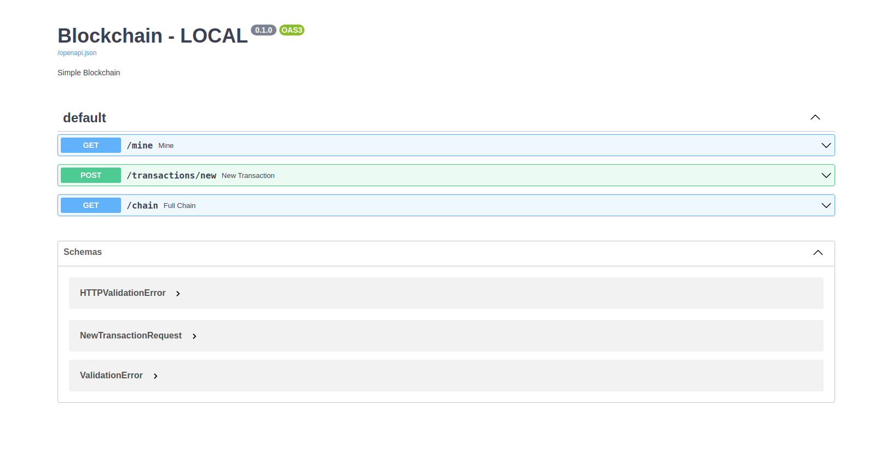

# Blockchain with FastAPI

## Description
A Simple detail for blockchain use language python.

Provide 3 simple endpoints:
- add transaction
- mine
- show all Blockchain 

## Installation
```
$ git clone ...
$ cd blockchain_fastapi
$ virtualenv -p python3 .venv
$ source .venv/bin/active
$ pip install -r requirements.txt
$ cp .env.example .env
$ uvicorn app.main:app --host 0.0.0.0 --port 5000 --reload
```

## Run project with Docker
**Required:** Installed Docker and docker-compose 
```
$ docker-compose up -d
```